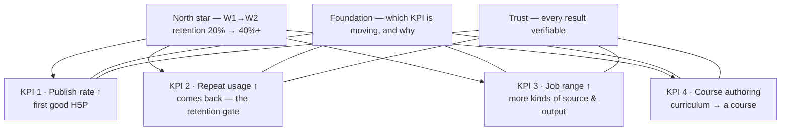

# H5P Smart Import — Reworked Educator Workflow

_Draft, 2026-08-31._

## Goal

**Reduce time-to-value and lift W1→W2 retention for H5P Smart Import.** Today an educator tries
Smart Import once and does not come back (~20% week-1 → week-2). This project redesigns the
educator workflow — how they express intent, choose what gets generated, review and refine the
output, and find it later — so the first result is trusted and cheap enough to build on.

It is delivered as (a) a working prototype that reproduces Smart Import's generate-from-source
behaviour, renders output in the real H5P player, and layers the redesigned workflow on top, and
(b) this spec. **The prototype is a means to test and demo the workflow before H5P engineering
commits — not a deliverable in itself.**

## Context

**Smart Import** (H5P.com) turns a source document into H5P interactive content using AI. A source
is **mandatory** — no from-scratch generation, so output is always grounded.

### The signal that shapes everything

**Smart Import W1→W2 retention is ~20%.** An 80% one-week drop after first use is not an
activation problem — people are trying it. It is a *"the first output wasn't worth coming back
for"* problem. Two causes dominate at that magnitude:

1. **Not trusted** — output was off, or the educator couldn't tell if it was right, so they
   returned to manual authoring.
2. **Cleanup cost > generation savings** — several activities generated, then an hour fixing them
   across several separate editors. Net-negative time.

Features that *compound* value (discoverability, preference memory) only help people who return.
They don't fix an 80% cliff. The roadmap sequences trust-and-cleanup first.

This read is corroborated by [existing customer feedback](#existing-customer-feedback) on the
shipped product — the section below records what was already known before the rework, and which
part of it this project takes on.

### Observed happy path (from a live run — "Plate Tectonics", pasted text → Single Choice Set + Summary)

1. Manage Content → **Smart Import** → **Create Content** (shows remaining import credits).
2. **Configure Content**: pick a source (File / YouTube / Wikipedia / Web Page / Pasted Text),
   optionally expand one **Customization** free-text box, choose output **language**. → Next
3. **Select Activities**: check any number from 4 categories (Test Knowledge / Present Content /
   Practice & Games / Interactive Media). No per-activity config. → Generate
4. **Generating Content** (~15–30s for two activities) → each activity becomes a **separate H5P
   content item** dumped flat into one "Smart Import" folder.
5. **Refine**: open each item → full H5P editor, or View. Export via player Reuse → Download `.h5p`.

---

## Existing customer feedback

Feedback on the **shipped** Smart Import, gathered before this rework — from the H5P
customer-success team's `customer-feedback-h5p` Slack channel and the "Customer feedback – Smart
Import" log (entries roughly Sep 2025 – Apr 2026). It is relayed customer voice (support tickets,
CS calls, one customer "test week"), not structured research: directional, not quantified. This
section records what was already known; [User Research](#measurement) will test it against real
sessions.

**Status column:** `addressed` — the rework's design answers it (built or specified); `partial` —
partly answered, with a named gap; `out of this slice` — a real ask this project isn't taking on
(H5P platform, or an explicitly later phase).

### 1 · Output lacks variety and depth

The most serious signal — a *"can't replace my workflow"* verdict, the same shape as the
retention cliff.

> "Smart Import primarily identifies only a limited number of concepts… often just a simple
> 'keyword and definition' pair, and the resulting exercises lack variety. [It] can't yet replace
> my current workflow, which involves using an LLM to generate diverse exercise types and then
> manually recreating them in H5P." — foreign-language / soft-skills author, after a test week

Also logged: *"AI-generated questions are too dry and miss visual info (graphs / drawings)"* (CS
log, Feb 2026).

→ The **recommendation engine** (purpose slots, feasibility + desirability) and **Remix** widen
type variety; the **source read-back** surfaces which concepts were found, so a thin extraction is
visible before generating. **Status: partial** — variety *across activities* is addressed;
"too few concepts pulled from a dense document" and richer *per-item* generation are not
specifically solved, and feed the [eval stream](#measurement) as generation-quality work.

### 2 · No control over what gets generated

Recurring, across several orgs.

- "select number of quiz questions" (K2 Kompetanse) · "specify how many questions, with how many
  answers per question, in a Question Set" · "adjust the difficulty level of the questions" · for
  Interactive Video, "no option to decide number / type of questions" and "no option to NOT have
  hotspots"

→ **Guided brief** (volume, emphasis, language), **per-activity mini-controls** (count,
difficulty), **recommendation-engine item counts**, and **explicit prompt instructions override**
the engine. **Status: addressed (design)** — per-activity count / difficulty is `next`, not yet
built; the Interactive-Video-specific controls are out of this slice.

### 3 · Distractors are obvious — "the longest answer is always correct"

Multiple independent reports; an internal investigation confirmed it — *"extra problematic for
specific languages, and when the different options are longer sentences."*

> "I would love any tips there are to getting better questions, and especially better distractors
> (it's always obvious that the long answer is the correct one)."

→ The Screen 3 **"Answers look wrong" steer** plus **per-question trust signals** (answer-key
note) make it catchable and fixable at the review gate; the **`review_event` stream** quantifies
how often it's hit, per content type and language. **Status: partial** — the review gate contains
the symptom; the underlying generation fix (length-balanced distractors, per-language prompt
tuning) is a known gap this rework surfaces but does not itself close.

### 4 · Authors want their own output templates

> "A customer wish it was possible to generate activities based on their own templates and not the
> template we have created."

Also logged as "organization templates for Smart Import content format and structure."

→ **Template library** — personal prompt / brief formats (built), **org templates** tier
(`later`). **Status: addressed** for personal templates; the org layer is a later phase.

### 5 · The flow is rigid — can't iterate mid-generation

- "navigate back and forth in the generation process (allow for more iterations underway)" ·
  "reduce friction by removing / automating steps" · "improved solution for where the generated
  content is saved"

→ The **reworked screen flow** (Back between steps), the **Refine / Remix loop** at the review
gate, and **content landing in the library** rather than a dedicated folder. **Status:
addressed.**

### 6 · Transparency — what the AI added vs. took from the source

- "Clearly state when additional information is added by the LLM, and what is directly taken from
  the input material" · "add more data to each generation: language settings, customization
  prompts used, which H5Ps were generated"

→ **Per-question trust signals** (exact source sentence, extracted-vs-inferred flag), the
persisted **`ImportRecord`** (source snapshot, intent, engine / model, outcome counts — built),
and the **"How it read your source"** view (`later`). **Status: addressed (design)** — grounding
and the import record are built; a line-level added-vs-source diff is `next` / `later`.

### 7 · Responsible-AI and author liability

A US customer, via CS:

> "individual teachers in the US… being sued by their students for using AI to create course
> content… less confident about recommending Smart Import" — asking for a statement that faculty
> remain responsible for, and central to, the content.

Related: avoid unhelpful generated feedback such as *"your answer is wrong because it is wrong."*

→ The rework's **approval gate**, **educator-as-author-of-record**, **AI-generated labeling** and
**known-limitations disclosure** put the author in control by construction. **Status: partial** —
the workflow makes the "faculty stays responsible" claim *true*; drafting the customer-facing
legal / positioning statement is H5P's job, not this project's.

### 8 · Out of this slice — noted, not taken on

| Ask | Raised by | Why out |
|---|---|---|
| Multiple sources in one generation | CS log | Job-range KPI, `later` |
| Audiovisual questions · IV auto-bookmarks · edit YouTube / MP4 captions | Univ. of Australia, CS log | Interactive Video / media — text sources come first |
| Branching-scenario output | College of Veterinary Medicine | Wider type coverage, Job-range KPI `later` |
| Norwegian UI still shows English buttons | Norwegian customer | H5P platform localization, not Smart Import logic |
| Credit system "feels old fashioned" → usage-based | London Met | H5P commercial model, not this workflow |
| Rebrand Smart Import · consolidate with the editor's AI assistant | internal strategic | H5P product strategy |

### What this changes

Nothing structural — the feedback **corroborates** the retention read and the four-part cut. The
one thing it sharpens: themes 1 and 3 are **generation-quality** problems the review gate
*catches* but does not *fix*. They sit under **Trust / Foundation** as continuous
generation-prompt work, prioritised off the `review_event` stream once it is live — not as a new
milestone.

---

## The four parts of the workflow

The rework touches four things the educator does. For each: what breaks today (from the H5P.com
walkthrough) and what we've added — every "reworked" item below is **new vs. the shipped
product**. The [opportunity map](#opportunity-map) re-cuts these same items by KPI; the
[roadmap matrix](#roadmap--the-matrix) places them by part × KPI; the detailed design follows
further down.

### 1 · Express intent — *what do I want, from what source*

| Today | Reworked (new) |
|---|---|
| One optional, collapsed "Customization" box → blank-page problem, usually skipped | **Design brief** — a written prompt **or** a structured brief (mutually exclusive); presets; save & reuse |
| No guidance on what a good prompt looks like | **Preset prompts** (Exam revision · Introduce a topic · Check prior knowledge · Extract questions) + **"Improve this prompt"** (rewrites rough text to best practice) |
| Re-type intent every import | **Prompt / brief library** — save, reuse, MRU-sorted, optionally bundles the activity selection; account-scoped later; org templates later |
| Source goes in as a black box | **Automatic source read-back** — type, length, reading level, concepts, themes, strengths, watch-outs. Advisory, non-blocking |
| Always generates new questions | **Question extractor** — pull existing questions from the source verbatim · Generate new · Both |
| `.pptx` (what lecturers actually use) generates poorly | **PowerPoint as a source** — slide + notes + structure parsing (Job range KPI) |

### 2 · Choose what gets made — *activity fit*

| Today | Reworked (new) |
|---|---|
| Blind checkboxes across 4 categories, no fit-to-source signal | **Recommendation engine v1** — feasibility gate (from source) + desirability rank (from intent) + count logic (1/2/3) |
| No item counts, no per-activity config | **"Why this fits" rationale** — per-type source + intent reason, with item counts; per-activity mini-controls (count, difficulty) |
| Easy to over-select → 5 overlapping activities that all need cleanup | Count capped at 3; marginal/infeasible types shown unchecked with the reason; **explicit prompt instructions override** the engine (with feasibility warnings) |
| No coverage view | **Per-activity controls + coverage grid** (objectives × activities) — planned |

### 3 · Review & refine what came back — *trust + fix* — the core

| Today | Reworked (new) |
|---|---|
| Generation commits **straight to N saved content items** — no checkpoint to see what was made and discard it; the AI ran regardless, and the cost that bites is the cleanup hour, not the credits | **Review & Approve** step — a proposed-content list held *before* anything enters the library; a **"Create N" gate** |
| To check or fix anything, open each item in the full H5P editor | **Live H5P preview per item** — Review (scan every question without answering) + Play (the real player) |
| No way to tell if a question is correct | **Per-question trust signals** — the exact source sentence, an answer-key note, a confidence level, extracted-vs-inferred |
| No targeted regeneration, no natural-language edit | **Refine ▾** — bounded steers (Harder · Easier · Simpler language · More formal · Different focus · Clearer · Answers look wrong · Try again); regenerates the activity for its type |
| Wrong activity type → discard, go back, re-pick | **Remix ▾** — rebuild as a different type, keeping the concepts |
| — | **Discard ▾** with a reason · **inline text edit** per item · **approve-by-default** (act on exceptions) |
| Refinement is per-artifact, one editor at a time | **Refine soft-cap (3)** → nudges to Remix / Discard / manual edit when the source×type pairing isn't working |
| No feedback loop | **`review_event` stream + `ImportRecord`** — the labelled dataset that answers "is quality good enough" with data, not opinion |
| One rigid flow | **Two UI shapes to demo** — A: step-by-step wizard · B: full-screen 3-panel workspace (setup · output · refinement chat) |

_Later (Repeat-usage KPI): scoped natural-language edits · propagate-a-fix · post-generation
coverage report._

### 4 · Find & reuse it later — *organization*

| Today | Reworked (new) |
|---|---|
| Every import dumps flat into a "Smart Import" folder — in fact **two** (a per-import subfolder *and* a global catch-all) | Content lands in the **content library** among everything else — no dedicated folder |
| No mapping of which content came from which import (a title prefix is the only clue) | Each item stamped **`from: <import>`** — a two-way link; **provenance as a library filter** |
| No record of what the import was | **Persisted `ImportRecord`** — source snapshot, intent, engine/model, outcome counts, per-item decisions, kept items. Survives reload and "Start another import" |
| — | Library view lists items across every persisted import; each `from:` tag opens that import's receipt |

_Later (Repeat-usage KPI): a standalone "Smart Imports" list screen · lifecycle (archive/delete an import + its content together) · destination-at-import-time._

### Threaded through all four — trust & measurement

Nothing is published without approval; the educator is author of record; every generate/edit is
audited. The educator's approve / refine / discard decisions **are** a free measurement stream
(see [Measurement](#measurement)).

---

## Opportunity map

*What we're solving for*, organised **by KPI** — every opportunity rolls up to one of four KPIs,
and all four roll up to the north-star retention number. **Foundation** (measurement) and
**Trust** sit under every KPI.

Two labels, used the same way here, in [the four parts](#the-four-parts-of-the-workflow) and in
the [roadmap matrix](#roadmap--the-matrix):

- **Horizon** — `now` / `next` / `later`: when it ships to production.
- **Prototype** — ✓ if the working prototype already demonstrates it. Independent of horizon —
  the prototype covers most of `now`, some of `next`, none of `later` yet.

**North star:** week-1 → week-2 retention, ~20% today → **40%+**.



### KPI 1 · Publish rate ↑ — *first good H5P*

*The educator ships a good first H5P. You can't retain a bad first run — this is the activation lever.*

| Opportunity | Part | Horizon | Prototype |
|---|---|---|---|
| **Source read-back** — what the AI sees in the source, before generate | Express intent | now | ✓ |
| **Recommendation engine** — feasibility + desirability + count | Choose what gets made | now | ✓ |
| **"Why this fits"** — per-type source + intent reason, with item counts | Choose what gets made | now | ✓ |
| **Review & approval gate** — a checkpoint before content is committed ("Create N") | Review & refine | now | ✓ |
| **Trust signals per question** — source span · answer-key note · confidence | Review & refine | now | ✓ |
| **Live H5P preview** — Review + Play, per item | Review & refine | now | ✓ |
| **Content in the library** — no dedicated folder | Find & reuse | now | ✓ |

### KPI 2 · Repeat usage ↑ — *the retention gate*

*Imports per active user per week. This KPI **is** the north-star number.*

| Opportunity | Part | Horizon | Prototype |
|---|---|---|---|
| **Prompt & brief library** — save & reuse a prompt or a brief format | Express intent | now | ✓ |
| **Design brief** — a structured brief: parameters + values, saveable as a template | Express intent | later | ✓ |
| **Improve my prompt** — rewrite a rough prompt to best practice | Express intent | next | — |
| **Per-activity controls & coverage** — count, difficulty; objectives × activities | Choose what gets made | next | — |
| **Refine / Remix / Discard** — bounded, per-activity, reasoned | Review & refine | now | ✓ |
| **Inline edit** | Review & refine | now | ✓ |
| **Per-element refine** — regenerate one question, not the whole activity | Review & refine | next | — |
| **Propagate-a-fix** — apply one correction across items; remember the preference | Review & refine | later | — |
| **Import record & provenance tag** — reopenable receipt · `from:` filter | Find & reuse | now | ✓ |

### KPI 3 · Job range ↑ — *more kinds of source & output*

*Widens who can use Smart Import at all, and for what.*

| Opportunity | Part | Horizon | Prototype |
|---|---|---|---|
| **Question extractor** — pull existing questions from the source verbatim, instead of generating new ones | Express intent | next | ✓ |
| **PowerPoint as a source** — slide + notes + structure parsing | Express intent | next | — |
| **Fidelity control** — how creative or restricted the output should be | Express intent | later | — |
| **Multiple sources** in one import | Express intent | later | — |
| **Creation without source** — generate from a brief alone, no source document | Express intent | later | — |
| **Wider type coverage** — more H5P types, by demand × value | Choose what gets made | later | — |
| **Images & diagrams** — carry them through; image-based types | Choose what gets made | later | — |
| **Extraction check** — extracted item ↔ source-span diff | Review & refine | next | — |

### KPI 4 · Course authoring — *curriculum → a course*

*Reuses the whole stack (intent → approval → refine → provenance). The later bet.*

| Opportunity | Part | Horizon | Prototype |
|---|---|---|---|
| **Curriculum as brief** — syllabus / outcomes drive generation | Express intent | later | — |
| **Map to objectives** — content ↔ modules / topics / objectives | Choose what gets made | later | — |
| **Course-aligned set** — generate a whole set in one pass | Choose what gets made | later | — |
| **Course workspace** — review, reorganise & refine the set | Review & refine | later | — |
| **Org controls** — admin generation policy + org-published formats | Find & reuse | later | — |

### Foundation — *measurement, under every KPI*

*The read instrument for every roadmap decision.* Fuller event detail in [Measurement](#measurement).

| Opportunity | Horizon | Prototype |
|---|---|---|
| **Approve / edit / refine / remix rate** — the educator's implicit quality signal, per content type, per source (`review_event` stream) | now | ✓ |

### Trust — *every result verifiable, under every KPI*

*An educator only publishes what they can check — this multiplies every KPI.*

| Opportunity | Horizon | Prototype |
|---|---|---|
| **Source read-back** — inspect the source behind any generated item | now | ✓ |
| **Evidence & rationale** — where an answer came from; flag unsupported | now | ✓ (partial) |
| **Value shown back to the educator** — "you approved 6 activities · ~40 min saved" | next | — |
| **"How it read your source"** — transparency view of the transformation | later | — |

### The compact view (one slide)

| KPI | What it measures | Where it stands |
|---|---|---|
| **Publish rate ↑** | First good H5P — first-use success | all `now` · 7 of 7 in the prototype |
| **Repeat usage ↑** | Imports / active user / week — *the retention gate* | `now → later` · 5 of 9 in the prototype |
| **Job range ↑** | More kinds of source & output | `next → later` · 1 of 8 in the prototype |
| **Course authoring** | Curriculum → a course | all `later` · none yet |
| **Foundation** | Which KPI is moving, and why | `now` · the approve / edit / refine / remix rate, in the prototype |
| **Trust** | Every result verifiable | `now → later` · 2 of 4 in the prototype |

---

## The reworked workflow (screen by screen, on top of the existing modal)

The existing Smart Import modal has a stepper: **Configure Content → Select Activities**. The
rework keeps that shell and inserts new steps.

### Screen 1 — Configure Content _(existing, enhanced)_

- **Source**: the rework focuses on **Pasted Text** and **Wikipedia** first — the two lowest-risk,
  highest-signal inputs. `.pptx` (Phase 2) and the other existing tabs (File / YouTube / Web Page)
  come after, once the core loop is proven.
- **NEW — Source read-back** runs **automatically** and **non-blocking** as the educator
  types/pastes (no "Analyze" button; "Choose activities" / "Quick generate" are available the
  moment a source exists, the read-back fills in behind them). It is **advisory** — it describes
  the material, it does not gate or discourage use:
  - **What it is**: content type, length, reading level, the themes the questions will draw on
    (weighted).
  - **Concepts**: substantive, multi-word things a teacher would assess — not a word-frequency
    dump.
  - **Strengths**: what this source is good raw material for.
  - **Watch-outs**: what to expect / what it won't cover well, phrased neutrally
    ("fact-dense — expect *what/when* over *why*"), never "don't use this".
  - **Existing questions**: count → the extract-vs-generate choice.
  Model-backed when a key is present; heuristic fallback otherwise.
  _(Parked: source-derived draft objectives. They're content *targets*, complementary to a
  predesigned prompt's *framing* — would return as a separate `targetObjectives` chip field, not
  appended prompt text, and hidden in extract mode.)_
- **NEW — Question handling** when questions are detected:
  **[Extract as-is]** · **[Generate new]** · **[Both]**. Extraction lifts the educator's own
  questions into the target H5P type with minimal rewriting — faster, and their own wording.
- **NEW — Design brief** replaces the single Customization box. The educator picks **one
  mode** — *Write a prompt* **or** *Guided brief* — never both at once (a free-text prompt and a
  structured brief can contradict each other). Prompt mode carries **preset prompts** to start
  from and an **"improve my prompt"** action; brief mode is a structured, parameterised form,
  saveable as a template. _(Making the brief a `later` priority — the current version is
  preliminary.)_
- **Language** unchanged.

### Screen 2 — Select Activities _(existing, enhanced)_

- Activity cards grouped by category, unchanged layout.
- **NEW — Recommendations**: the pre-checked set + per-type item count + a one-line reason, from
  the **Activity recommendation engine** (see below); marginal / infeasible types shown unchecked
  with the reason.
- **NEW — Per-activity mini-controls** on the card: item count (pre-filled by the engine),
  difficulty.

### Screen 3 — Review & Approve _(NEW — the core)_

- **Proposed content list**, grouped by activity; each item shows its target concept / objective.
- **Two views of the selected activity:**
  - **Review** _(default)_ — every question laid out as a list, correct answer marked, so the
    educator can **scan without answering**. Each question carries its own trust signals.
  - **Play** — the real H5P player, the learner experience, for a feel check.
- **Actions — MVP.** Approve is the **default, not a click**; the educator acts on the exceptions.
  - **Item level** (one question / card / word): **Edit only** — inline text, manual, no AI.
    (Regenerating one question in isolation risks breaking coherence with the rest — so AI
    refinement is activity-level.)
  - **Activity level:**
    - **Refine ▾** — a bounded picker that *steers* a full regeneration of the activity, not
      just a re-roll. Grouped:
      - _Difficulty:_ Harder · Easier
      - _Language & tone:_ Simpler wording · More formal · In another language ▸ (fixed
        language list — note: questions change, it is not a translation)
      - _Coverage:_ Different focus ▸ (submenu built from the source read-back's concept list) ·
        Less repetitive
      - _Quality:_ Clearer wording · Answers look wrong
      - _Blunt:_ Just try again
      One click → the whole activity is regenerated for its type with that steer. Warns:
      "regenerates every question, including your edits." Refine keeps the **type** fixed.
    - **Remix ▾** — rebuild this activity as a *different* type (Single Choice Set → Drag Text,
      etc.), reusing the concepts it already covered. Picker lists the types the prototype can
      render; one click regenerates in the new format from the same source. Edits are dropped (the type
      changed) — the menu warns. This is the positive path for "wrong format" — it replaces the
      old "discard + re-pick on Screen 2" detour.
    - **Discard ▾** — a bounded reason picker: wrong activity type · quality too low · redundant
      with another · source doesn't support it · not useful. Drops the activity.
  - **Refine cap:** soft limit of **3 refines per activity**. Tries 1–3 behave normally; after
    the 3rd, the button stops being a plain re-roll and surfaces "three tries haven't landed
    this — the source may not support a strong [type] here" with Remix / Discard / Edit
    manually made primary. A 4th is still possible, just not the default. Remix is not capped
    (each remix changes type, so it is not slot-machine behaviour) but is logged.
  - **Gate button:** "Create N" — N = every activity not discarded.
  - _Deliberately out of MVP:_ item-level regenerate/drop · diagnosis→strategy branching on
    Refine · "refine instead of discard" redirects · difficulty/count/type as standalone
    controls (they're Refine steers) · coverage-grid-tied Add-item.
- **Trust signals are per question**, not per activity: each question shows the exact source
  sentence it was built from, a one-line answer-key note, and a confidence level.

**Feedback → eval stream.** Every review-stage action writes a `review_event`:
`{ importId, contentType, engine, model, sourceKind, readbackKind, sourceLength, intent{mode,
authoringMode, preset, emphasis, volume}, action: "edit"|"refine"|"remix"|"discard", reason (the
picker value / steer / from-type), toType? (remix), field?, charsDelta?, attempt?, timestamp }`
— plus one `create_summary` per import (generated / created / edited / refined / remixed /
discarded). The `create_summary` is additionally **persisted in full as an `ImportRecord`**
(`POST /api/imports` → `.imports.jsonl`, beside `.review-events.jsonl`, gitignored):
`{ id (=importId), name, createdAt, source{kind, value (the real text/URL), wordCount,
readbackKind}, intent, promptPresetId, engine, model, outcome{generated,kept,edited,refined,
remixed,discarded}, decisions[{itemId, contentType, kept, edited, charsDelta, refineAttempts,
refineSteers[], remixCount, remixFrom, discarded, discardReason}], items[{id,title,contentType,
concepts,contentJson}] }`. That record is the receipt — reached from any content item's `from:`
tag — and it survives "Start another import" and a reload. This is the labelled dataset
that gives **approve-without-edit rate**, **which steer people reach for** (→ tune defaults: lots
of "Harder" = generate harder), **discard reasons per source kind**, **edit magnitude per
field**, and **refine attempt-loops** (≥3 = the source can't support that type). It also answers
"is quality good enough" with data instead of opinion.
- **Coverage grid**: objectives × activities.
- **Cost line**: "This will use 2 credits and create 18 items."
- **[Approve N & create]**.

### After "Create N" — land in the content library _(NEW — replaces the silent auto-file)_

Not a step. "Create N" creates the activities in the **content library** — where all H5P content
lives — and drops the educator there, **filtered to this import**:

- Each new item is stamped **`from: <import>`** (auto-named: source/title + date) and shows up
  among the rest of the library, not in a separate folder. Items land as **draft**.
- A banner confirms "N created", and **"Open import details"** expands the receipt inline:
  source, prompt/brief, engine + model, and the outcome — N generated → kept / edited / refined /
  remixed / discarded (with per-item discard reasons). It is a click-through, not a screen you
  pass through. The receipt is a **persisted `ImportRecord`** (see the eval-stream note above),
  so it is still there after "Start another import" or a reload.
- The import mapping *is* the organisation: the library view lists items across every persisted
  import, and each item's `from:` tag opens that import's receipt. No name step, no destination
  picker, no publish gate.
- **Start another import** re-enters the flow; the just-finished import stays in the library.

**Two objects, one home each.** The import is an event (immutable receipt: source, intent,
decisions); the content items are living objects that live in the library. Keep both indexes —
"what did I import?" (the Smart Imports list) and "what content do I have?" (the library) —
bound by a two-way link, **not** by a folder. Collapse today's two folders (per-import subfolder
+ global catch-all) into nothing: content is just in the library, found via the import filter.

_Phase 2:_ per-import destination on create (course/unit) for teams that want it · a
post-creation Refine workspace — scoped natural-language edits ("shorten all summary
statements"), propagate-a-fix-and-remember, inline flag-distractor · publish-set-as-a-batch.

---

## Stages (detail)

### Stage 1 — Design brief

The educator authors intent in **exactly one mode** — a written prompt **or** a guided brief.
They are mutually exclusive: a free-text prompt and a set of structured fields can contradict
each other, and it's ambiguous which wins. A segmented toggle switches between them.

**Write a prompt**

| Element | Behaviour |
|---|---|
| Free-text box | The primary input. Lowest friction; default mode. |
| **Preset prompts** | Clickable, each fills the box with a best-practice prompt: _Exam revision · Introduce a topic · Check prior knowledge · **Extract existing questions**_. |
| **"Improve this prompt"** | Model rewrites the rough text to prompt-engineering best practice — imperative, specific, and only filling in audience / focus / count / difficulty **where the rough text states or implies it** (never invents them). One-click revert. **Shown only in Scratch** (a predesigned prompt is already best practice; there's nothing to improve). |

**Guided brief** — same three-part shape as *Write a prompt*: a **"Start from:"** row, one
editable panel, contextual save actions.

- **Start from:** `Recommended` (selected by default — the recommended field values, *not* an
  empty form) · `★ <saved brief>` for the educator's own saved briefs.
- **The panel** is one uniform list of parameter rows. Five standard fields — learning goal,
  audience, emphasis, volume, language — drive the recommendation engine and analytics and stay
  fixed. Then the educator's own **`+ Add parameter`** rows: a name and a value
  (*Curriculum: AP Biology* · *Tone: encouraging* · *Avoid: exam dates*). Everything serialises
  into one instruction internally — the standard fields plus `name: value;` for each added one.
- **Save:** `Save this brief` (always available) captures the field values **and** the added
  parameters as a named, reusable **brief format**; `Update "<name>"` / `Save as a new brief`
  appear when a loaded brief has been edited, exactly like the prompt section.

TTV is unchanged on the fast path — *Recommended* → type a learning goal → Choose activities;
the added parameters are opt-in. _Phase 2:_ admins publish brief formats (required parameters,
house values) org-wide; for now every educator builds their own.

**Template library** — one library, holds both **prompts** and **brief formats**, three tiers:

| Tier | Source | Editable |
|---|---|---|
| **System templates** | The predesigned prompts (Exam revision, Introduce a topic, Check prior knowledge, Extract existing questions) | Read-only, used as-is |
| **Personal templates** | Any Scratch prompt **or** guided brief (fields + custom parameters) the author saved — named | Author's own (rename / delete) |
| **Org templates** _(admin layer, later)_ | Admins publish org-wide prompts and brief formats | Read-only to authors |

Personal templates appear in the "Start from:" row for their mode — prompt templates next to the
system ones (`[Scratch] [system…] [★ My Grade 9 Bio]`), brief templates next to `Recommended` —
and in a searchable **📚 Template library** dropdown.

**Reuse — how an educator picks up a saved prompt on a future import:**

- **Bundled scope.** A template optionally carries the **activity selection** too (and, later,
  the destination folder). Reuse then collapses to: pick template → activities already chosen →
  add source → generate. One real step.
- **Surface the likely one.** Templates sort most-recently-used first; the last-used one carries a
  "recent" marker so a regular user's default is one glance away.
- **Edit without clobbering.** Loading a template puts a prompt into editable Scratch — tweak it
  for this import freely. If the tweak is worth keeping, an **"Update '<name>'"** action appears;
  otherwise "Save as new".
- **Manage.** A "Your templates" list — rename, delete.
- **Productionisation:** in the prototype templates live in `localStorage` (per browser). In the
  product they must be **account-scoped** so they follow the educator across devices, and become
  the substrate for org-published templates.

This turns intent authoring from per-import typing into pick-a-template for regular users — the
core repeat-use / TTV win.

_Governance (Phase 3):_ authors keep full freedom over their own briefs and templates. Org
consistency (house style, spelling, accessibility, integrity) is enforced through an **invisible
admin-set generation policy** appended to every prompt — not by locking the author-facing brief.
Admins may *add* org templates and at most 1–2 required fields (course, curriculum standard),
never *remove* the core fields or restrict free-text prompt mode. Heavy admin-controlled forms
would work against the TTV guardrail.

**Question extraction** — the *Extract existing questions* preset (and the read-back's "Extract
them as-is" action) sets a verbatim-extraction instruction and switches the run to extract mode:
pull each question from the source exactly as written, carry over options and marked answers,
invent nothing.

_Prompt vs. architecture:_ the **prompt does the extraction reasoning** — finding questions,
mapping each to an H5P type. That much is prompt-only and is verified working on clean text
(a pasted quiz → 3 questions pulled verbatim with answers preserved). The **architecture owns
input handling and the trust guarantee:**

| Case | Prompt-only enough? | Needs |
|---|---|---|
| Pasted text, linear questions | Yes | — |
| PDF / DOCX / scanned exam papers | No — prompt assumes clean text | Layout-aware extraction (+ OCR) — the same ingestion pipeline `.pptx` needs |
| Verbatim guarantee on a teacher's own exam | No — LLMs quietly paraphrase, drop options, renumber, or invent a key | A verification pass: extracted item ↔ source-span diff, flag every mismatch |
| Long banks (50–200 Qs) | No — quality degrades with length | Chunk + stitch + dedup |
| Separate answer keys | Weak | Structured key resolution |
| Image-dependent questions | No | Media handling — deferred with image support |

**What makes prompt-only viable now:** the approval gate. The educator checks every extracted
question against its source span before anything is created, so an imperfect extraction is
caught, not shipped. Sequencing: ship prompt-only extraction for **Pasted Text** in Phase 1;
file-based extraction (PDF/DOCX) rides on the `.pptx` ingestion pipeline in Phase 2, with the
automated verbatim-diff check added then.

**Also in Stage 1:**

- **Source read-back** before activity selection — advisory, non-blocking: type · length ·
  reading level · weighted themes · substantive concepts · Strengths · Watch-outs · draft
  objectives. Describes the material; never a go/no-go verdict.
- **Content-type recommendation** — the pre-checked activity set + item counts, from the
  **Activity recommendation engine (v1)** documented below (feasibility gate from the source,
  desirability rank from the intent, count 1–3, explicit prompt instructions override).
- **Auto-propose learning objectives** from the source.
- **Question extractor** — when the source already contains questions (worksheet,
  question bank, past paper), detect them and offer to import as-is into the chosen H5P type
  rather than generating new ones. Faster, and it is the educator's own material.
- **PowerPoint (.pptx) as a first-class source** — lecturers live in PowerPoint; today's
  generation from `.pptx` is weak. Proper slide + speaker-notes + structure parsing. _(Assumption
  to validate: `.pptx` is a very common lecturer format.)_
- **Images — deprioritized.** Complex, and low value for the content types Smart Import currently
  produces — Crosswords, Question Set, Single Choice Set, Summary, Glossary (difficult words /
  key concepts), Higher-Order Questions, Interactive Book, Dialog Cards (conceptual / contextual),
  Drag the Words, The Chase are all text-based; only Interactive Video needs media. Revisit when
  image-based content types (Image Hotspots, image Drag-and-Drop, Find the Hotspot) enter the
  Smart Import catalog.

**Considered and not pursuing — "suggest a full prompt from the source."** Mechanically easy, but
the prompt exists to carry the educator's *intent* — audience, purpose (formative vs. summative),
depth, the sub-topic students struggle with — none of which is in the learning material. A prompt
derived from the source alone can only restate the read-back and do what Smart Import already
does by default. If a source-only prompt were good enough, the prompt wouldn't be needed. What
the source *can* inform stays in: proposed objectives, content-shape guardrails, mode
pre-selection, and nudges after the educator has written something. _Backlog exception:_ if the
input is a **lesson plan / syllabus / outcomes doc** (source-as-brief, not source-as-content), it
does contain intent and could auto-fill objectives + prompt.

### Activity recommendation engine (v1)

**In one paragraph.** The engine decides *which activity types to pre-check on Screen 2*, how
many, and how many items each — nothing else. It reads two inputs. The **source** (via the
read-back) tells it what a *good* activity of each type would need and whether this material has
it — that's **feasibility**, a hard gate. The **intent** (the prompt or brief) tells it which of
the feasible types serve the teacher's goal — that's **desirability**, which only ranks *within*
what's feasible. Count and item-count are rules layered on top. Every output is a suggestion the
teacher overrides on Screen 2; an explicit instruction in the prompt ("make 3 crosswords") wins
outright, bounded only by what the source can support without padding.

**What each decision depends on, and the rule:**

| Decision | Depends on | The rule |
|---|---|---|
| **Is type X feasible?** | source read-back: `kind`, whether `concepts` are short terms vs. ideas, `wordCount`, number of `themes`, `detectedQuestions` | a per-type checklist (Step 1) — e.g. Crossword needs many short named terms; Interactive Book needs length **and** multiple sections; Summary needs paraphrasable claims |
| **Which feasible types?** | intent: `emphasis`, prompt keywords (*vocab / terms / definitions* · *teach / introduce / explain* · *exam / quiz / assess*), the brief's goal | purpose slots (recall / understanding / practice / teach) + an intent tilt; Single Choice Set is the default first pick (Step 2, 4) |
| **How many types — 1 / 2 / 3?** | `wordCount`, number of `themes`, prompt breadth vs. narrowness (*quick / warm-up / diagnostic* → narrow; *full / comprehensive / cover the unit* → broad) | 2 by default (one recall + one understanding); 1 if the source is short/single-topic or the intent is narrow; 3 only if the source is long **and** multi-section **and** the intent signals breadth. Never > 3 (Step 3) |
| **Items per type?** | `volume` (light 4 / standard 6 / thorough 10), `wordCount`, number of `concepts` | start at `volume`; cap at ~1 item per 60–100 words of substantive content, or ~1.5 × distinct concepts, whichever is lower; with 2–3 activities, target **10–15 items total across the set**, not per activity (Step 5) |

**Why this shape:**

- **Feasibility before desirability**, always. An intent that wants a Crossword can't force one
  onto a source with no short terms — a contrived crossword fails the educator at the review gate
  anyway. Ranking only happens inside the feasible set.
- **Feasibility is an LLM job; everything else is deterministic rules.** Feasibility needs to
  *read* the source (short terms? definitional sentences? multiple sections?), so it's folded
  into the one analyze call that produces the read-back. Purpose slots, count, type selection and
  item counts are pure functions of the read-back + intent — so they **re-rank instantly** when
  the teacher changes emphasis, volume, or the prompt, with no extra API call.
- **A hard cap of 3**, because each activity is another block to review at the gate and multiple
  activities from one source tend to overlap — more types is usually worse, not better.
- **Every threshold is a dial.** This is v1; the count boundaries, the words-per-item ratio, the
  purpose→type mappings and the intent-keyword lists are all expected to move with real usage
  (see *v1 — expected to be refined* below).

**Output contract.** The engine produces exactly one thing: the **recommended (pre-checked) set
of content types on Screen 2**, each with a suggested **item count** and a **reason that names
the source trait and the intent trait it is responding to**. It does not generate content, pick
destinations, or gate progression. Everything it proposes is overridable on Screen 2.

#### Step 1 — Feasibility gate (from the source read-back)

Each catalogue type is marked `feasible | marginal | infeasible`:

| Type | Feasible when the source has… | Infeasible / weak when… |
|---|---|---|
| Single Choice Set | assertable facts with clear right answers | pure opinion, nothing assertable |
| Question Set | enough distinct facts for a multi-item quiz, or existing questions to hold | very short source |
| Summary | paraphrasable explanatory claims | lists / tables / reference data — nothing to paraphrase |
| Crossword | many single-word / short named terms (terminology, people, places) | explanatory prose, few named terms → contrived clues |
| Drag the Words | definitional or structural sentences with an unambiguous removable key word | narrative prose, no clean gaps |
| Dialog Cards | term↔definition or Q↔A pairs | continuous narrative |
| Interactive Book | length **+** multiple sub-topics / sections | short single-topic blurb |
| Interactive Video | a video source | text source (disabled) |

Signals used: read-back `kind`; whether `concepts` are short terms vs. ideas; `wordCount` +
number of `themes`; `detectedQuestions`; `watchOuts`. Marginal / infeasible types still appear on
Screen 2 — unchecked, with the reason shown.

#### Step 2 — Purpose slots

A recommendation covers **distinct pedagogical purposes**; at most one activity per purpose:

| Purpose | Types |
|---|---|
| Check recall | Single Choice Set · Dialog Cards · Crossword |
| Check understanding | Summary · Question Set |
| Practice / consolidate | Dialog Cards · Drag the Words · Crossword |
| Present / teach | Interactive Book |

#### Step 3 — How many activity types

- **Default 2** — one *recall* + one *understanding* (Single Choice Set + Summary, or + Question
  Set for a richer source). Different cognitive levels, minimal overlap.
- **1** if any of: source < ~400 words or single-topic · only one purpose feasible · intent is
  narrow ("quick check", "diagnostic", "warm-up"). → the single best-fit type for the dominant
  purpose.
- **3** only if **all** of: source long **and** multi-section · intent signals breadth ("full
  revision set", "cover the unit") · a third distinct purpose is feasible.
- Never auto-check more than 3 — each activity is another block to review at the gate, and
  multiple activities from one source tend to overlap.

#### Step 4 — Which types, within the count

1. Feasible only.
2. One per purpose slot — never two recall types.
3. **Single Choice Set is the default first pick** — it works on almost any expository source, for
   both assessment and practice.
4. Intent tilts the rest: assessment emphasis → + Question Set; teaching emphasis → + Summary /
   Interactive Book; prompt mentions "terms / vocabulary / definitions" → swap in Crossword /
   Drag the Words.

#### Step 5 — Item count per recommended type

- Start at `volume` (light ≈ 4 · standard ≈ 6 · thorough ≈ 10).
- **Cap up** by source: ≤ ~1 item per 60–100 words of substantive content, or ~1.5 × the
  read-back's distinct concepts — whichever is lower.
- **Cap down** for coherence: with 2–3 activities, ~4–5 each; target **~10–15 items total across
  the set**, not per activity.
- Never pad to hit a number.

#### Explicit user instructions override

If the prompt names types, a count of activities, or an item count, **that instruction wins** and
the engine becomes advisory — it still shows feasibility warnings ("you asked for a Crossword but
this source has few single-word terms"), it does not override the choice.

```
explicit prompt instruction
  >  on-screen manual activity selection (types only)
  >  volume setting
  >  engine default
        ↓  every level capped by  ↓
   what the source supports without repetition (quality floor)
```

An explicit number is still bounded by feasibility: "10 questions" on a source that yields 7 good
ones → generate 7, and say so at the approval gate ("requested 10; source supported 7 without
repetition"). Never silently ignore, never silently pad. Detected via the LLM intent pass
(`requestedTypes`, `requestedActivityCount`, `requestedItemCount`) with a regex fast-path.

#### Implementation split

- **Feasibility = LLM** — it needs to read the source (single-word terms? definitional sentences?
  multiple sections?). Folded into the analyze call that produces the read-back.
- **Purpose slots, count, type selection, item count = deterministic rules** on the feasible set +
  intent. Keeps re-ranking **instant** when the user changes emphasis / volume / prompt — no
  extra API call.

#### v1 — expected to be refined

This is a starting rule set; every threshold is a dial. Refinements we anticipate from real
usage: the 1/2/3 count thresholds, the words-per-item ratio, the purpose→type mappings, whether
"marginal" types should ever be pre-checked, and how aggressively intent keywords swap types.

### Stage 2 — Approval (a checkpoint before content is committed)

Plan preview → proposed-content list → **live interactive H5P preview per item** → per-item
approve / drop / edit / refine → per-activity controls → coverage grid → cost line →
review workspace (not auto-filed).

**Review assist** (not eval infrastructure — lightweight checks that make approval faster and
more confident, built largely from approval-gate telemetry once edit patterns are visible):
reading level vs. target · duplicate-concept detection · "distractor may be defensible" ·
answer-key sanity · coverage vs. objectives · consistency with source. The educator's
approve/drop/edit decisions are a free measurement stream — the gate exists anyway.

### Stage 3 — Refinement

**MVP (built into Screen 3 — see that section for detail).** Two bounded levers, no free-form
natural-language editing:

- **Item level: Edit only.** Inline manual text edit of one question / card / gap. No per-item
  AI refine — regenerating a single item in isolation breaks coherence with the rest of the
  activity.
- **Activity level: Refine ▾, Remix ▾ and Discard ▾.**
  - **Refine** re-runs the whole activity *for the same type* with one *steer* from a closed,
    grouped list — Difficulty (Harder / Easier), Language & tone (Simpler wording / More formal /
    In another language), Coverage (Different focus / Less repetitive), Quality (Clearer wording /
    Answers look wrong), or just "Try again". Each steer rewrites the generation prompt; it is
    not just logged. Language, tone and difficulty are Refine steers, not a separate mechanism.
  - **Remix** rebuilds the activity as a *different* type, reusing the concepts it covered — the
    positive path for "wrong format", replacing the old "discard + re-pick" detour.
  - **Discard** takes a reason from a closed list (wrong activity type · quality too low ·
    redundant · source doesn't support it · not useful).
  - Refine and Remix both regenerate every item, edits included — the UI warns.
- **Refine cap: soft limit of 3 per activity.** After 3 unsuccessful refines, the control stops
  offering a plain re-roll and points at Remix / Discard / manual edit — the source×type pairing
  is the likely problem, and a 3-refine activity is a strong "this source can't support this
  type" label for the recommendation engine. Remix is uncapped (each changes type) but logged.

Every action writes a `review_event` (schema in the Screen 3 section); this is the labelled
eval stream — approve-without-edit rate, which steer people reach for, remix from→to pairs,
discard reasons by source kind, refine attempt-loops.

**Not built (Repeat-usage KPI items).** Per-element refine (regenerate one question) · scoped
natural-language edits · propagate-a-fix (and remember) · diagnosis→strategy branching on Refine ·
"refine instead of discard" redirect · post-generation coverage report with "fill the gap" ·
attempt-loop escalation ("this source keeps failing for this type — try a different type").

### Stage 4 — Discoverability & organization

Per-import stamp on every item · provenance as a library filter · two-way navigation (import ↔
content) · import-details receipt · lifecycle (archive/delete import + its content together).

**No dedicated "Smart Import" content folder.** Today's product has two — a per-import subfolder
*and* a global catch-all — with no clear mapping between an import and its content. Drop both:
content just lives in the library, and the **import mapping** (a `from:` tag + a filter) is what
ties a set together.

**Built (prototype):** each finished import is a server-persisted `ImportRecord`
(`.imports.jsonl`); the library view lists items across every persisted import, and each item's
`from:` tag opens that import's receipt. Survives "Start another import" and reload.

**Not built (Repeat-usage KPI items).** A standalone **Smart Imports list** screen (the second
index — "what did I import?"), full two-way navigation, and lifecycle (archive/delete an import +
its content together). Render output is not yet namespaced by import
(`public/h5p/_render/<itemId>/` collides across imports), so a *reopened* past import shows item
metadata but is not re-playable — namespacing + `_render` GC is a later item.

### Stage 5 — Trust

Source grounding per item · extraction-vs-inference flag · answer-key justification ·
factual-consistency-vs-source flag · confidence indicator · objective + Bloom's alignment ·
nothing published without approval · educator is author of record · generate-vs-edit audit
trail · AI-generated labeling · source-reliability signal · known-limitations disclosure ·
personal track record · confusion-report loop · generation transparency.

---

## Measurement

**North star — W1→W2 creator retention** (~20% today). Everything below is a leading indicator of it.

### The funnel — adoption → activation → retention

| Stage | Event | Metric |
|---|---|---|
| Opened the flow | `import_started` | starts per eligible user per week |
| Finished setup | `generate_requested` | setup-completion rate |
| Generation returned | `generate_completed {ok, latencyMs}` | success rate · latency |
| Acted in review | `review_opened` · `item_previewed {itemId}` | % of items actually previewed |
| Shipped | `create_completed {kept, discarded}` | **activation — % of starts that create ≥ 1** (target ≥ 60%) |
| Used it | `content_published` / `content_embedded` | published-not-just-created rate |
| Returned | next `import_started` by the same user within 7 d | **W1→W2 retention** |

Today the prototype logs `create_completed` (as `create_summary` + the full `ImportRecord`) and
every review-stage action. The rest are new one-line events.

### Time to value — measure two ways

- **In-flow TTV** = `create_completed − import_started`. Split out `generate_completed →
  create_completed` — that is **the cost of the review gate**, and it must not balloon vs. today.
- **Time to usable** = `first content_published − import_started`, plus **total edit-minutes in
  the 7 days after create** (later edits tied back to `importId`). This is where the rework should
  *win*: today's path is fast to "content in a folder", slow to "content I'd show a class".
- **Baseline to beat:** today's Smart Import = source → dump → open each editor → fix. If the
  live product can't be instrumented, stopwatch 3–5 educator sessions.

### Usage & quality

| Metric | Derived from |
|---|---|
| imports per active user per week | `import_started` |
| activities kept / generated per import | `ImportRecord.outcome` |
| **approve-without-edit rate** (kept ∧ ¬edited ∧ ¬refined ∧ ¬remixed) | `ImportRecord.decisions` |
| **rubber-stamp rate** (kept ∧ never `item_previewed`) | events |
| refine / remix / discard rates + reason breakdown | `review_event` |
| edit magnitude (`charsDelta`) | `review_event` |
| post-create edit rate at 7 / 30 d | later content edits keyed by `importId` |
| learner confusion reports per 100 activities | product signal (later) |

### Retention

W1→W2 and W1→W4 return rate · % of W1 imports whose creator does another in W2 · content-reuse
rate (created activities embedded in a course).

### A vs B — the two UI shapes

Both variants share the event stream. Tag every event and every `ImportRecord` with `uiVariant`
and an anonymous `sessionId`. Then, **unit = import**, compare A vs B on: activation rate ·
in-flow TTV · review-gate cost · approve-without-edit rate · refine actions per import. Live:
retention by variant.

### To add to the prototype

1. `uiVariant` + `sessionId` (one per browser, `localStorage`) on `review_event` and `ImportRecord`.
2. Milestone events: `import_started` · `generate_requested` / `generate_completed {latencyMs}` ·
   `item_previewed` · `create_completed` (rename the current summary).
3. A small roll-up (a script or `/api/metrics`) that turns `.review-events.jsonl` +
   `.imports.jsonl` into the funnel + TTV + approve-without-edit numbers — so the demo can *show*
   the dashboard, not just describe it.

---

## Roadmap — the matrix

The same opportunities from the [opportunity map](#opportunity-map), placed where they act:
**workflow part** across, **KPI** down. Each entry shows its **horizon** (`now` / `next` /
`later`) and **✓** if the prototype already has it.

### North star & guardrail

- **North star: retention** — Smart Import used again the week after first use (~20% today →
  **40%+**). The intermediate levers are **publish rate** (KPI 1) and **repeat usage** (KPI 2).
  Full metric tree in [Measurement](#measurement).
- **Guardrail — don't add time-to-value.** Every checkpoint, read-back and recommendation must
  make the *whole* job (idea → usable content) faster, not just insert a step. The fast path
  stays source → generate → create: read-back is automatic and non-blocking, recommendations
  pre-checked, review approve-by-default.
- **Foundation** and **Trust** ship *continuously*, under every row — never as a milestone.

### The matrix

| KPI ↓ / Part → | 1 · Express intent | 2 · Choose what gets made | 3 · Review & refine | 4 · Find & reuse |
|---|---|---|---|---|
| **KPI 1 · Publish rate ↑**<br>*the Sprint 2 demo — fully in the prototype* | `now ✓` Source read-back | `now ✓` Recommendation engine<br>`now ✓` "Why this fits" | `now ✓` Review & approval gate<br>`now ✓` Trust signals per question<br>`now ✓` Live H5P preview | `now ✓` Content in the library |
| **KPI 2 · Repeat usage ↑**<br>*W1→W2 20% → 40%+ — the retention number* | `now ✓` Prompt & brief library<br>`later ✓` Design brief<br>`next` Improve my prompt | `next` Per-activity controls & coverage | `now ✓` Refine / Remix / Discard<br>`now ✓` Inline edit<br>`next` Per-element refine<br>`later` Propagate-a-fix | `now ✓` Import record & provenance tag |
| **KPI 3 · Job range ↑**<br>*more kinds of source & output* | `next ✓` Question extractor<br>`next` PowerPoint as a source<br>`later` Fidelity control<br>`later` Multiple sources<br>`later` Creation without source | `later` Wider type coverage<br>`later` Images & diagrams | `next` Extraction check | — |
| **KPI 4 · Course authoring**<br>*curriculum → a course — reuses the whole stack* | `later` Curriculum as brief | `later` Map to objectives<br>`later` Course-aligned set | `later` Course workspace | `later` Org controls |

### Foundation & Trust — continuous (under every cell)

**Foundation — measurement:** `now ✓` the educator's **approve / edit / refine / remix rate**,
per content type and source (`review_event` stream). This is the read instrument for every
decision below.

**Trust — every result verifiable:**

| Opportunity | Horizon | Prototype |
|---|---|---|
| Source read-back | now | ✓ |
| Evidence & rationale | now | ✓ (partial) |
| Value shown back to the educator | next | — |
| "How it read your source" view | later | — |

### Sequencing — why this order

1. **Publish rate first.** Retention is the goal, but you cannot retain an educator whose first
   run was unusable — the ~20% cliff *is* a first-run-quality problem. This row is also the
   smallest scope and already built, so it **is** the Sprint 2 demo: the demo and the roadmap's
   first bet are the same thing.
2. **PowerPoint as a source next.** The single biggest ask from real usage; it widens the top of
   the funnel (more educators can use Smart Import *at all*), which compounds with a publish rate
   that is now good.
3. **Repeat-usage refinements after we can measure them.** Per-element refine and propagate-a-fix
   are polish on a loop that already works — ship them once the approve / edit / refine rate shows
   they cut real work, not before.
4. **Course authoring last.** It reuses the entire stack (intent → approval → refine → provenance),
   so every earlier investment carries into it; building it early would mean building on an
   unvalidated foundation.

The **approve / edit / refine / remix rate** is already live and never waits for a horizon — it
is the number the sequencing above is read from.

**Quick wins, shippable independently, any time:** "evaluate my prompt" · the value shown back
to the educator (the data is already collected).

### How the prototype de-risks this

The prototype is a working reproduction of Smart Import's generate-from-source behaviour, on which
the reworked workflow (intent → approval → refine → discover → trust) is built and demoed as if
live — without waiting on H5P engineering. It runs the same input Smart Import takes (a source +
an activity choice) and produces the same kind of output (H5P content.json rendered in the real
player). All generated content comes strictly from the source the educator provides; nothing is
canned. The prototype is the vehicle for testing whether the approval gate + grounding move the
retention needle before committing engineering to it.

---

## Sprint 2 demo

**Review & Approve → content library, built end-to-end**, with a slice of Screen 1 (auto source
read-back + intent + recommended activities) feeding it: an educator pastes a source (or a
Wikipedia URL), optionally states intent → recommended activities are pre-checked → generates →
sees a proposed-content list with a **live playable H5P preview per item** rendered in the real
player, plus grounding / answer-key trust signals → edits / refines / remixes / discards →
"Create N" → lands in the content library, each item tagged `from:` its import, with the
import-details receipt (a persisted `ImportRecord`) one click away — still reachable after
starting another import or reloading.

All previewed content is generated from that source in the session. Feedback question for
mentors: *"Would you trust this enough to put it in front of learners with only light review?"*
